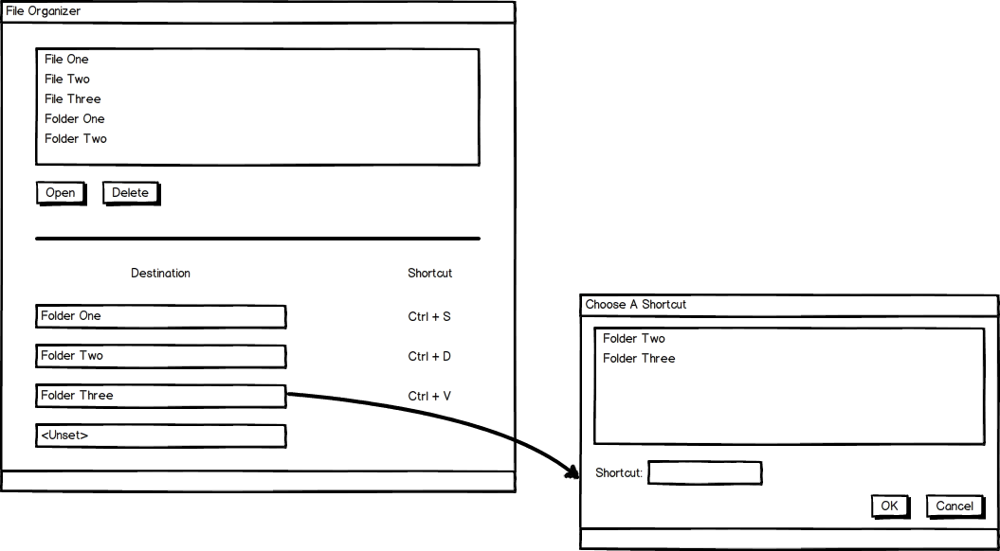

clj-file-organizer
==================

A simple file organizer written in Clojure.  This is a mockup of how it works:

Why does this project exist?
============================

I built this because I couldn't find a program that made it easy to move a bunch of files into a bunch of different locations.  This was annoying to do in the Windows explorer so I decided to make a program to do it.

Also, it was a good opportunity to learn clojure.

How does it work?
==============

On the left hand side is the frame that opens when you start.  The top of it is a file chooser of files and folders you can select.  Below the divider is a table with *Destinations* on the left and *Shortcuts* on the right.  If you press the shortcut, the file/folder you've selected in the file chooser will be moved to the destination.

The frame on the right pops up if you click any of the *Destination* buttons. It brings up another file chooser where you can only select folders and a text field that lets you type in a shortcut.

How do I install it?
=============

Right now the only way to install the program is to download the source and to run `lein run`.  I plan to make this easier in the future.             